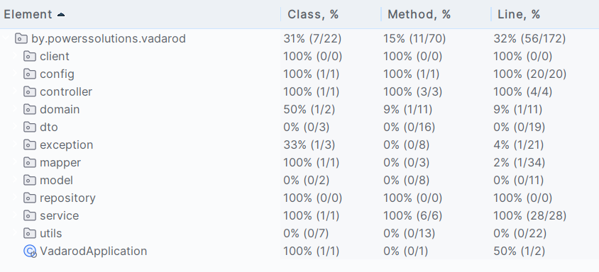

<h1 align="center">Сервис для получения и отображения курсов с сайта РБ РБ</h1>

<details>
 <summary><strong>
  Техническое задание
</strong></summary>

## ЗАДАНИЕ:

### Основные сущности:

В рамках тестового задания предлагается реализовать микросервис с использованием фреймворка Spring Boot.
Ожидаемые технологии: Spring MVC, Hibernate, Spring Data JPA, H2 Database, Maven

Основной задачей данного микросервиса будет получение и отображение курсов валют с сайта НБ РБ (API национального
банка: https://www.nbrb.by/apihelp/exrates).
Требуется создать 2 точки входа (endpoint) - формат данных, метод запросов, формат ответа и набор дополнительных данных
запроса/ответа определяется разработчиком:

1. Endpoint с входящим параметром - дата.
   Результат запроса - ответ, указывающий на корректность выполнения загрузки данных в разработанную систему о курсах за
   выбранную дату.
2. Endpoint с входящими параметрами - дата и код валюты. Результат запроса - информация о курсе валюты за указанный
   день.

Информация должна храниться во встроенной базе данных (далее БД). Создание БД и её сущностей должна происходить при
первом старте сервиса.
</details>

<details>
 <summary><strong>
  Стек
</strong></summary>

### При разработке были использованы:

* Java 17
* Maven
* Spring-boot
* Spring-cloud (OpenFeign / Resilience4j)
* Mapstruct
* H2
* Liquibase
* Springdoc-openapi
* Junit / Assertj
* Wiremock

</details>

<details>
 <summary><strong>
  Запуск проекта
</strong></summary>

* Скачайте проект с gitHub:
    * https://github.com/NortinPowers/vadarod-test-task.git
* Откройте терминал или командную строку и перейдите в директорию вашего проекта
* Соберите jar-файл с помощью комманды сборщика ```mvn clean package -DskipTests``` (с пропуском тестов для ускорения
  сборки)
* Разверните jar файл ```java jar vadarod-0.0.1-SNAPSHOT.jar``` из target в контейнере сервлетов tomcat
* Либо используйте для развертывания среду разработки

</details>

<details>
 <summary><strong>
  Endpoints
</strong></summary>

* Конечные точки подробно описаны по средствам Open Api

* __GET__ __/{date}__ возвращает сообщение о загрузке данных (при запросе или ранее)
    * {date} - дата в формате yyyy-MM-dd (2024-10-12).
    * Формат ответа - строка
        * ```Currency exchange rates for the selected date have been successfully uploaded```
* __GET__ __/{date}/{code}__ возвращает данные о курсе обмена на выбранную дату
    * {date} - дата в формате yyyy-MM-dd (2024-10-12)
    * {code} - буквенный код валюты по ИСО 4217 (USD)
    * Формат ответа - json
      ``` 
      {
      "status": 200,
      "timestamp": "2024-06-30T10:24:29.116828",
      "currency": "USD",
      "officialRate": 3.1624,
      "date": "2024-06-30"
      }
      ```
</details>

<details>
 <summary><strong>
  Open Api
</strong></summary>

* документация доступна по адресу http://localhost:8080/documentation
* api-doc доступны по адресу http://localhost:8080/documentation/api-doc

</details>

<details>
 <summary><strong>
  Параметры запуска
</strong></summary>

* Профайл конфигурации - prod
* Параметры запросов согласно документации API по ключу __request.value__
    * __periodicity: 0__
    * __parammode: 2__

</details>

<details>
 <summary><strong>
  База данных
</strong></summary>

* Используется база H2
* После старта сервиса она доступна по адресу http://localhost:8080/h2-console/
* Параметры входа:
    * JDBC URL: <strong>jdbc:h2:mem:vadarod</strong>
    * User Name: <strong>admin</strong>
    * User Password: <strong>admin</strong>

</details>

<details>
 <summary><strong>
  Тесты
</strong></summary>

* Сервис - 100%
* Контроллер - 100%
* Репозиторий - 100%

<details>
<summary><strong>Скриншот покрытия</strong></summary>

 </details>
</details>

<details>
 <summary><strong>
  Спецификация API
</strong></summary>

Спецификация находится по адресу https://www.nbrb.by/apihelp/exrates

Официальный курс белорусского рубля по отношению к иностранным валютам, устанавливаемый Национальным банком на
конкретную дату:
Адрес запроса: https://api.nbrb.by/exrates/rates[/{cur_id}]

Параметры (GET):

* ondate** – дата, на которую запрашивается курс (если не задана, то возвращается курс на сегодня)
* periodicity – периодичность установления курса (0 – ежедневно, 1 – ежемесячно)
* parammode – формат аргумента cur_id: 0 – внутренний код валюты, 1 – трехзначный цифровой код валюты в соответствии со
  стандартом ИСО 4217, 2 – трехзначный буквенный код валюты (ИСО 4217). По умолчанию = 0

При использовании буквенного или цифрового кода валюты (ИСО 4217) учитывайте его значение на запрашиваемую дату.

Результат: Возвращает массив объектов класса Rate. Если указан cur_id, то возвращается один объект Rate.

Класс Rate содержит следующие свойства:

* Cur_ID – внутренний код
* Date – дата, на которую запрашивается курс
* Cur_Abbreviation – буквенный код
* Cur_Scale – количество единиц иностранной валюты
* Cur_Name – наименование валюты на русском языке во множественном, либо в единственном числе, в зависимости от
  количества единиц
* Cur_OfficialRate – курс*

Примеры использования:

* получение официального курса белорусского рубля по отношению к иностранным валютам, устанавливаемого ежедневно, на
  сегодня: https://api.nbrb.by/exrates/rates?periodicity=0
* получение официального курса белорусского рубля по отношению к иностранным валютам, устанавливаемого ежедневно, на 10
  января 2023 года: https://api.nbrb.by/exrates/rates?ondate=2023-01-10&periodicity=0
* получение официального курса белорусского рубля по отношению к иностранным валютам, устанавливаемого ежемесячно, на 10
  января 2023 года: https://api.nbrb.by/exrates/rates?ondate=2023-01-10&periodicity=1
* получение официального курса белорусского рубля по отношению к 1 Доллару США на
  сегодня: https://api.nbrb.by/exrates/rates/431 – по внутреннему коду валюты
    * https://api.nbrb.by/exrates/rates/840?parammode=1 – по цифровому коду валюты (ИСО 4217)
    * https://api.nbrb.by/exrates/rates/USD?parammode=2 – по буквенному коду валюты (ИСО 4217)
* получение официального курса белорусского рубля по отношению к 100 Российским рублям на 10 января 2023
  года: https://api.nbrb.by/exrates/rates/456?ondate=2023-01-10

</details>
